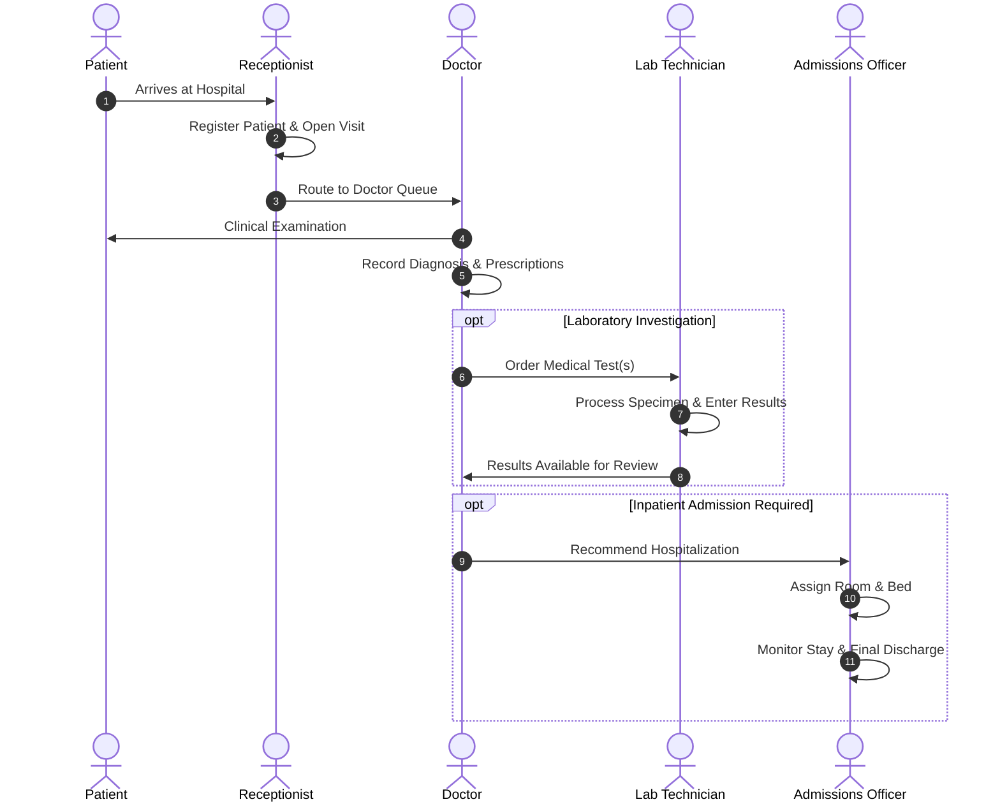
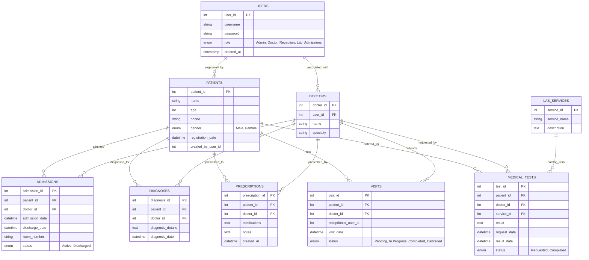

# Al-Badr Hospital Management System (HMS)

<p align="center">
  
</p>

<p align="center">
  <strong>A Modular, Role-Based Healthcare Management & Electronic Health Record (EHR) Platform</strong>
</p>

<p align="center">
  
  
  
  
  
</p>

---

## 📋 Table of Contents
- [Overview & Abstract](#-overview--abstract)
- [System Architecture](#-system-architecture)
- [Core Functional Modules](#-core-functional-modules)
- [Role-Based Access Control (RBAC)](#-role-based-access-control-rbac)
- [Patient Lifecycle Workflow](#-patient-lifecycle-workflow)
- [Database Schema & ERD](#-database-schema--erd)
- [RESTful APIs for Mobile / External Apps](#-restful-apis-for-mobile--external-apps)
- [Project Directory Structure](#-project-directory-structure)
- [Installation & Local Deployment Guide](#-installation--local-deployment-guide)
- [Database Seeding & Default Credentials](#-database-seeding--default-credentials)
- [Security Specifications](#-security-specifications)
- [License](#-license)

---

## 🏥 Overview & Abstract

**Al-Badr Hospital Management System (HMS)** is a comprehensive, production-oriented healthcare software system designed to streamline patient care, clinical operations, laboratory diagnostics, and administrative workflows in hospitals and medical centers.

Built using native PHP with **PDO (PHP Data Objects)** and a relational MySQL architecture, the system enforces complete referential integrity, strong access control mechanisms, and a separation of clinical and administrative responsibilities. In addition to a responsive web portal, the system exposes CORS-enabled JSON REST API endpoints allowing seamless integration with mobile companion apps (such as Flutter-based clinical and patient applications).

---

## 🏛 System Architecture

The application adopts a modular, domain-driven structure organized by operational department:

- **Data Access Layer:** Uses PHP PDO with prepared statements, preventing SQL injection and standardizing error handling.
- **Service & Business Logic:** Encapsulated in domain-specific module controllers (`admin`, `doctor`, `reception`, `lab`, `admissions`).
- **Presentation Layer:** Responsive web interface customized dynamically based on the authenticated user's role.
- **API Gateway Layer:** Dedicated RESTful endpoints returning structured JSON responses with cross-origin resource sharing (CORS) support for mobile clients.

---

## 🧩 Core Functional Modules

| Module | Primary Responsibilities |
| :--- | :--- |
| **🔐 Authentication (`modules/auth`)** | Secure user login, session initialization, role-based redirection, and credential hashing. |
| **💼 Administration (`modules/admin`)** | High-level analytics, visit tracking, patient census reports, lab services catalog management, and user administration. |
| **📋 Reception (`modules/reception`)** | Patient registration, biographical indexing, appointment booking, and clinic queue dispatching. |
| **🩺 Clinical / Doctor (`modules/doctor`)** | Medical consultation notes, diagnostic logging, prescription issuance, and lab test requisition. |
| **🔬 Laboratory (`modules/lab`)** | Requisition processing for 50+ pre-seeded clinical tests, test result entry, and printable diagnostic lab reports. |
| **🛏 Admissions (`modules/admissions`)** | Inpatient bed management, room allocation, active stay monitoring, and formal discharge processing. |

---

## 👥 Role-Based Access Control (RBAC)

The system implements strict role-based authorization to safeguard patient confidentiality and maintain clinical governance:

| Feature / Action | Admin | Doctor | Reception | Lab Technician | Admissions Staff |
| :--- | :---: | :---: | :---: | :---: | :---: |
| System Analytics & Global Tracking | ✅ | ❌ | ❌ | ❌ | ❌ |
| Manage Lab Services Catalog | ✅ | ❌ | ❌ | ❌ | ❌ |
| Register New Patients | ❌ | ❌ | ✅ | ❌ | ❌ |
| Schedule & Create Visits | ❌ | ❌ | ✅ | ❌ | ❌ |
| View Medical Records & Diagnoses | ✅ | ✅ | ❌ | ❌ | ❌ |
| Issue Prescriptions & Order Tests | ❌ | ✅ | ❌ | ❌ | ❌ |
| Enter Lab Results & Print Reports | ❌ | ❌ | ❌ | ✅ | ❌ |
| Inpatient Room Allocation & Discharge| ❌ | ❌ | ❌ | ❌ | ✅ |

---

## 🔄 Patient Lifecycle Workflow



---

## 🗄 Database Schema & ERD

The relational database (`albadr_hospital`) consists of 9 core tables structured with foreign keys and cascading referential integrity:



---

## 📱 RESTful APIs for Mobile / External Apps

The system includes dedicated RESTful endpoints tailored for mobile clients (e.g. Flutter mobile apps):

| Endpoint | Method | Params | Response Description |
| :--- | :---: | :--- | :--- |
| `modules/auth/api_login.php` | `POST` | `username`, `password` | Authenticates user; returns user profile, ID, and authorized role. |
| `api/api_get_patient.php` | `GET` | `?id={patient_id}` | Full patient profile with complete clinical history (visits, diagnoses, prescriptions, lab results). |
| `api/api_visit_v2.php` | `GET` | `?visit_id={visit_id}` | Comprehensive visit overview with patient demographics, attending doctor details, and clinical notes. |
| `api/api_get_test_details.php` | `GET` | `?test_id={test_id}` | Diagnostic laboratory requisition status and test results. |

---

## 📁 Project Directory Structure

```text
albadr-hms/
├── .gitignore                   # Git exclusion rules for clean repository
├── LICENSE                      # MIT Open Source License
├── README.md                    # Academic & technical documentation
├── index.php                    # Application entry point & session router
├── config/
│   ├── database.php             # Active database connection settings
│   └── database.example.php     # Environment-agnostic config template
├── db/
│   └── albadr_hospital.sql      # Schema definitions with DDL & constraints
├── includes/
│   ├── PatientFlowHelper.php    # Operational helper utilities
│   ├── api_cors.php             # Cross-Origin headers utility
│   └── header.php               # Shared UI header & navigation
├── modules/                     # Department-specific functional modules
│   ├── admin/                   # Administrative dashboards & tracking
│   ├── admissions/              # Inpatient stay management
│   ├── auth/                    # Session management & auth API
│   ├── doctor/                  # Clinical consultations & diagnostics
│   ├── lab/                     # Laboratory requisitions & results
│   └── reception/               # Patient intake & clinic scheduling
├── api/                         # Mobile REST API endpoints (Flutter companion)
│   ├── api_get_patient.php
│   ├── api_get_test_details.php
│   ├── api_get_visit_details.php
│   └── api_visit_v2.php
├── assets/                      # Static assets
│   ├── css/style.css            # Stylesheets
│   └── img/logo.png             # Hospital branding assets
└── scripts/                     # Seeders & development maintenance utilities
    ├── seed.php                 # Core seed script (Users + 50 lab tests)
    ├── seed_lab.php             # Laboratory catalog seeder
    └── add_manager.php          # Admin provisioning script
```

---

## 🚀 Installation & Local Deployment Guide

### Prerequisites
- **Web Server:** Apache (via XAMPP, WAMP, LAMP, or native Apache2).
- **PHP Version:** PHP 7.4 or 8.x (with `pdo` and `pdo_mysql` extensions enabled).
- **Database:** MySQL 5.7+ or MariaDB 10.3+.

### Step-by-Step Setup

1. **Clone the Repository:**
   ```bash
   git clone https://github.com/your-username/albadr-hms.git
   cd albadr-hms
   ```

2. **Configure Database Connection:**
   Copy the example configuration to `config/database.php`:
   ```bash
   cp config/database.example.php config/database.php
   ```
   Edit `config/database.php` with your local database credentials:
   ```php
   $host     = 'localhost';
   $dbname   = 'albadr_hospital';
   $username = 'root';
   $password = '';
   ```

3. **Import Database Schema:**
   Import the provided SQL dump into your MySQL server:
   ```bash
   mysql -u root -p albadr_hospital < db/albadr_hospital.sql
   ```
   *(Or import `db/albadr_hospital.sql` via phpMyAdmin).*

4. **Seed Initial Data:**
   Run the database seeder from your browser or CLI:
   - **Browser:** Navigate to `http://localhost/albadr-hms/scripts/seed.php`
   - **CLI:**
     ```bash
     php scripts/seed.php
     ```

5. **Launch Application:**
   Access the system via your browser:
   ```text
   http://localhost/albadr-hms/
   ```

---

## 🔑 Database Seeding & Default Credentials

Executing `scripts/seed.php` provisions 50 standard medical tests and creates the following default accounts for testing and evaluation:

| Role | Username | Password | Notes |
| :--- | :--- | :--- | :--- |
| **Admin** | `admin` | `123` | System Administrator |
| **Doctor** | `doctor1` | `123` | Dr. Mohammed (Cardiology) |
| **Reception** | `reception1` | `123` | Front Desk Receptionist |
| **Lab** | `lab1` | `123` | Clinical Laboratory Technician |
| **Manager** | `manager` | `123456` | Created via `scripts/add_manager.php` |

> [!NOTE]
> All passwords in the database are hashed using PHP's native `password_hash()` with the **BCRYPT** algorithm. For production environments, remember to update these passwords immediately.

---

## 🔒 Security Specifications

- **Prepared Statements:** All queries touching dynamic user inputs use PDO parameterized queries to eliminate SQL Injection vectors.
- **Cryptographic Password Storage:** Utilizes BCRYPT hashing via `password_hash()` and `password_verify()`.
- **RBAC Verification:** Each module contains role validation at the script header to prevent unauthorized route traversal.
- **Clean JSON Output:** API endpoints explicitly set JSON headers and silence raw HTML errors to prevent data leakage and ensure predictable client parsing.

---

## 📄 License

This project is licensed under the **MIT License** - see the [LICENSE](LICENSE) file for details.
